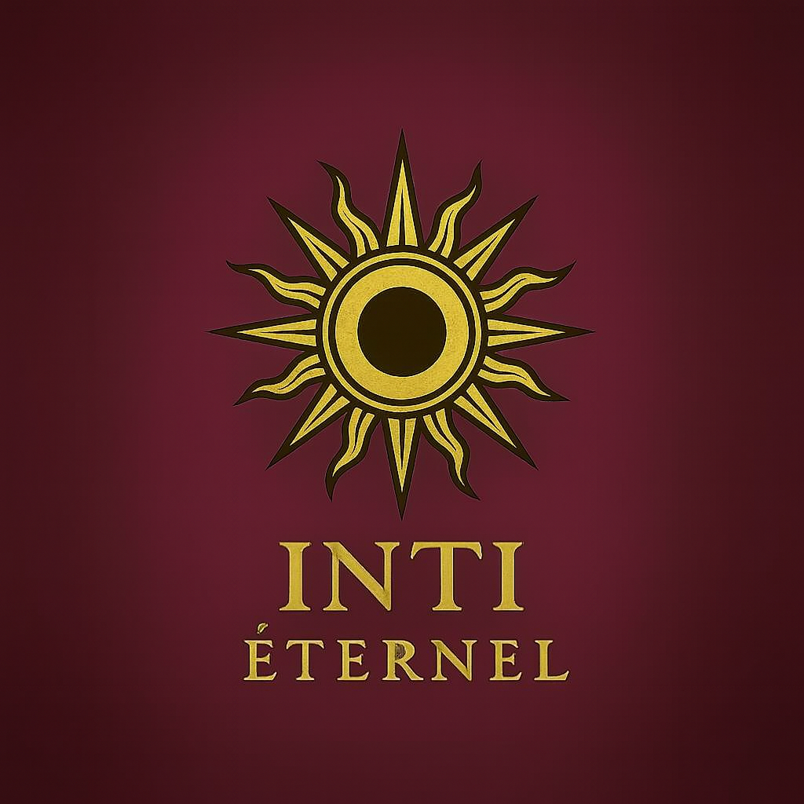

<!DOCTYPE html>
<html lang="es">
<head>
<meta charset="utf-8">
<meta name="viewport" content="width=device-width, initial-scale=1">
<title>INTI Éternel · Streaming</title>
<meta name="description" content="Netflix, Disney+, HBO Max, Crunchyroll, Paramount+ y Prime Video por 1 mes. Combos con descuento y garantía de 30 días. Precios en pesos chilenos y soles.">
<link rel="preconnect" href="https://fonts.googleapis.com">
<link rel="preconnect" href="https://fonts.gstatic.com" crossorigin>
<link href="https://fonts.googleapis.com/css2?family=Cormorant+Garamond:wght@500;600;700&family=DM+Sans:wght@400;500;700&display=swap" rel="stylesheet">

</head>
<body>

<header class="hero">
  

    
    <h1>INTI ÉTERNEL</h1>
    
Tus series y tu anime, cada mes.

    

      <a class="btn main" href="#carta">Ver precios</a>
      <a class="btn ghost" href="#contacto">Pedir el mío</a>
    

  

</header>

<main>
  <section id="carta">
    

      <h2>Servicios por 1 mes</h2>
      
Elige el servicio y paga en tu moneda. Cada uno incluye garantía de 30 días.

      

        <button type="button" data-cur="clp" aria-pressed="true">Chile · CLP</button>
        <button type="button" data-cur="pen" aria-pressed="false">Perú · PEN</button>
      

      <ul class="menu">
        <li>Netflix1 mes$5.400</li>
        <li>Netflix15 días$3.100</li>
        <li>Disney+1 mes$3.100</li>
        <li>HBO Max1 mes$2.550</li>
        <li>Crunchyroll1 mes$2.250</li>
        <li>Paramount+1 mes$2.250</li>
        <li>Prime Video1 mes$2.000</li>
      </ul>
    

  </section>

  <section id="combos">
    

      <h2>Combos con descuento</h2>
      
Junta servicios y paga menos que comprándolos por separado.

      

        

          <h3>Netflix + Disney+</h3>
          
Dos de los más pedidos, por 1 mes.

          $7.900
        

        

          <h3>Netflix + Disney+ + Crunchyroll</h3>
          
Series, películas y anime.

          $9.900
        

        

          <h3>HBO Max + Paramount+ + Prime Video</h3>
          
Tres catálogos por 1 mes.

          $5.950
        

        

          <h3>Los 6 servicios</h3>
          
Todo el catálogo en un solo pago mensual.

          $15.850
        

      

      
¿Quieres otra combinación? Pídela y te cotizo el precio.

    

  </section>

  <section id="como">
    

      <h2>Cómo pedir</h2>
      <ol class="steps">
        <li>
<b>Elige tu servicio o combo</b>Escríbenos con lo que quieres.
</li>
        <li>
<b>Paga</b>Te enviamos los datos de pago según tu país.
</li>
        <li>
<b>Recibe tu acceso</b>Lo entregamos apenas confirmemos el pago. Si algo falla durante el mes, lo resolvemos o lo reponemos.
</li>
      </ol>
    

  </section>
</main>

<footer id="contacto">
  

    <h2>Pide el tuyo</h2>
    
Escríbenos por mensaje directo y te respondemos con tu acceso y los pasos de pago.

    

      <a class="btn main" href="https://www.instagram.com/inti_eternel.streaming" target="_blank" rel="noopener">Instagram</a>
      <a class="btn ghost" href="https://www.tiktok.com/@inti_eternel.streaming" target="_blank" rel="noopener">TikTok</a>
      <!-- Cuando tengas tu WhatsApp Business, quita los signos de comentario y cambia el número (código de país + número, sin + ni espacios):
      <a class="btn main" href="https://wa.me/NUMERO_AQUI" target="_blank" rel="noopener">WhatsApp</a>
      -->
    

    
INTI Éternel es un servicio independiente y no está afiliado a Netflix, Disney+, HBO Max, Crunchyroll, Paramount+ ni Prime Video. Las marcas pertenecen a sus respectivos dueños. Precios por 1 mes, salvo donde se indica. Los precios en soles y pesos chilenos pueden cambiar con el tipo de cambio.

  

</footer>

</body>
</html>
